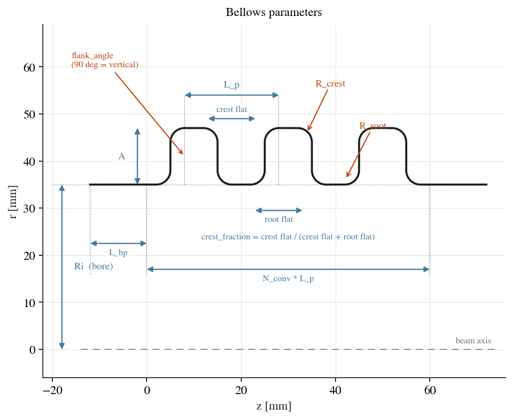
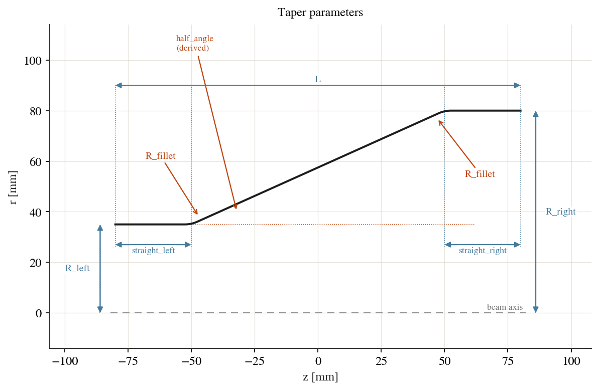
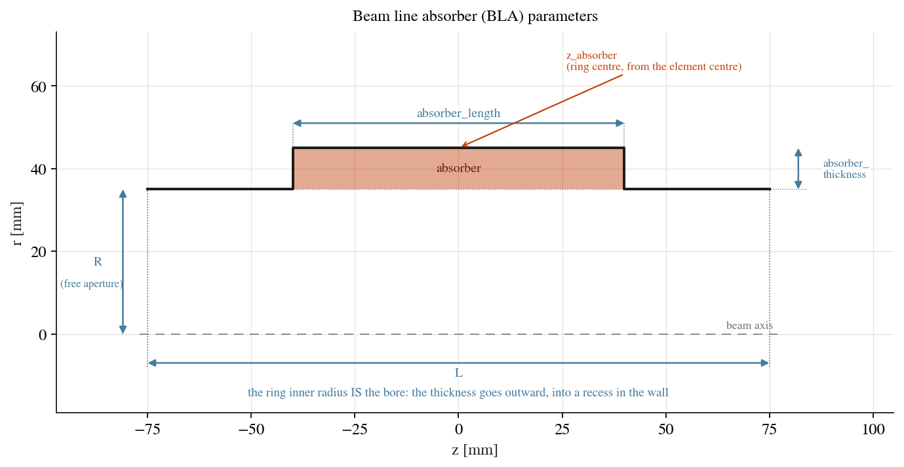

Geometry and parameterisation
=============================

Every cavity is an axisymmetric structure, so its geometry is fully described
by the meridian — the 2D outline of the wall in the ``(z, r)`` half-plane
(``r >= 0``). cavsim2d builds that outline once, from a small set of named
parameters, and the *same* outline drives every analysis (eigenmode, wakefield,
multipacting). There is no separate geometry per solver — see
:ref:`geometry-one-for-all` below.

The unified geometry model
--------------------------

A model turns its parameters into a :class:`~cavsim2d.geometry.Profile`: a chain
of boundary segments (lines and exact ellipse / circle / spline arcs) walked from
the axis, around the wall, and back. Each segment carries a boundary-condition
label:

- ``PEC`` — a perfect *electric* conductor: the cavity wall.
- ``PMC`` — a perfect *magnetic* conductor: an aperture / symmetry plane
  (the beam-pipe mouth, or a cell mid-plane in a reduced tuning geometry).
- the axis ``r = 0`` is the axisymmetry line and is handled implicitly.

These labels are the only "physics" the geometry carries; the solver reads them to
set boundary conditions. ``cav.plot('geometry')`` draws the meridian (the upper
half only — the analysed domain).

Material regions
----------------

The meridian encloses one region, vacuum by default. A cavity can also declare
dielectric sub-regions with
:meth:`~cavsim2d.models.base.Cavity.add_dielectric` — an axisymmetric
rectangular ring in ``(z, r)``, i.e. an annular cylinder in 3D:

.. code-block:: python

    # a 0.5 mm-thick quartz tube lining a 5 mm aperture, running the full length
    cav.add_dielectric('quartz', 3.8, z=(-1e4, 1e4), r=(2.0, 2.5), maxh=0.15)

Lengths are in millimetres, like every other cavity dimension, and the region
is clipped to the cavity — so a generous ``z`` span simply means "the full
length". ``maxh`` sets the local element size inside the region, which a thin
shell needs.

Internally the profile face is split into one named face per region plus the
background (``'Domain'``), and the pieces are glued so the mesh is conformal
across each interface. That is what lets the ``HCurl`` space enforce
tangential-``E`` continuity — the physical dielectric interface condition — with
no special handling in the solver. Each interface becomes its own boundary named
``IF_<material>``, distinct from ``PEC``/``PMC`` so it carries no boundary
condition; it can be addressed for local refinement via ``edge_maxh``.

Material regions are used by the eigenmode solver only; see
:ref:`eigenmode:Dielectric regions` for the physics, the extra QOIs and the
limits.

.. _geometry-one-for-all:

One geometry, every analysis
----------------------------

The single meridian serves all three analyses, and the differences between them
live entirely in the configuration dictionaries (see
:doc:`configuration`), never in the geometry:

- Eigenmode meshes the profile directly (native ``netgen.occ``) or via a
  ``.geo`` file; mesh resolution is ``eigenmode_config['mesh_config']`` (``h``, ``p``).
- Wakefield writes an ABCI deck from the *same* profile. ABCI requires a beam
  pipe at each end, so the writer adds one automatically if the geometry has none
  — you do not author a wakefield-specific shape. Bunch, wake length and
  rotation are ``wakefield_config`` keys.
- Multipacting reuses the eigenmode field and mesh: it reads the ``PEC``
  wall vertices as emission sites and tracks electrons in the solved field. It
  needs no geometry of its own; its resolution can be refined with
  ``multipacting_config['pec_maxh']`` / ``mesh_config``.

So a new geometry only has to produce a correct labelled meridian *once*; it then
works in every analysis (see :doc:`extending`).

Built-in parameterisations
--------------------------

All lengths are in millimetres.

Elliptical cavity (:class:`~cavsim2d.models.elliptical.EllipticalCavity`)
^^^^^^^^^^^^^^^^^^^^^^^^^^^^^^^^^^^^^^^^^^^^^^^^^^^^^^^^^^^^^^^^^^^^^^^^^^^^
The workhorse SRF shape. A half-cell (one quarter of a full cell's meridian)
is seven parameters ``[A, B, a, b, Ri, L, Req]``:

- ``A``, ``B`` — the *z* and *r* semi-axes of the equator ellipse (outer wall).
- ``a``, ``b`` — the *z* and *r* semi-axes of the iris ellipse (near the aperture).
- ``Ri``      — the iris / aperture (beam-pipe) radius.
- ``L``       — the half-cell length (iris plane to equator plane); a full cell is ``2 L``.
- ``Req``     — the equator radius.

The wall inclination ``alpha`` is *derived* from these (an optional 8th slot is
accepted and ignored on input). A full cell mirrors the half-cell about the
equator plane and the axis; a multi-cell cavity chains ``n_cells`` of them::

    EllipticalCavity(n_cells, mid_cell, end_cell_left, end_cell_right, beampipe='both')

``mid_cell`` sets the interior cells; ``end_cell_left`` / ``end_cell_right`` set
the two ends (each defaults to ``mid_cell``). See :ref:`geometry-multicell`.

Flat-top elliptical (:class:`~cavsim2d.models.elliptical_flattop.EllipticalCavityFlatTop`)
^^^^^^^^^^^^^^^^^^^^^^^^^^^^^^^^^^^^^^^^^^^^^^^^^^^^^^^^^^^^^^^^^^^^^^^^^^^^^^^^^^^^^^^^^^^^^^
An elliptical cell with a straight flat section at the equator, taking the
same per-cell parameterisation as the elliptical cavity. Used where a flattened
equator is wanted (e.g. some low-beta or crab geometries).

Pillbox (:class:`~cavsim2d.models.pillbox.Pillbox`)
^^^^^^^^^^^^^^^^^^^^^^^^^^^^^^^^^^^^^^^^^^^^^^^^^^^^^
A right-cylinder cavity, five parameters ``[L, Req, Ri, S, L_bp]``:

- ``L``    — cell (barrel) length along the axis.
- ``Req``  — cavity (barrel) radius.
- ``Ri``   — iris / aperture (beam-pipe) radius.
- ``S``    — inter-cell drift length (the straight gap between adjacent cells at ``Ri``; 0 to butt cells together).
- ``L_bp`` — beam-pipe length added at each end selected by ``beampipe``.

::

    Pillbox(n_cells, [L, Req, Ri, S, L_bp], beampipe='both')

Spline cavity (:class:`~cavsim2d.models.spline.SplineCavity`)
^^^^^^^^^^^^^^^^^^^^^^^^^^^^^^^^^^^^^^^^^^^^^^^^^^^^^^^^^^^^^^^
A free-form wall defined by six Bézier control points ``p0 .. p5``, each a
``[z, r]`` coordinate pair::

    SplineCavity({'geometry': {'p0': [0, 35], 'p1': [0, 70], 'p2': [30, 103],
                               'p3': [85, 103], 'p4': [115, 70], 'p5': [115, 35]}})

Each coordinate is individually addressable as a tune / UQ variable named
``p<i>_z`` and ``p<i>_r`` (e.g. ``'p2_r'``, ``'p3_z'``). Placing a control point
at the pipe radius gives a *C1*-continuous (smooth, non-sharp) iris.

For a spline cavity, ``cav.plot('geometry')`` also overlays the control points
and the polygon connecting them (dashed, over the interpolated wall) — so you
can see where each ``p<i>`` sits relative to the curve it shapes. It is on by
default; pass ``control_points=False`` to hide it (or ``True`` to force it).
``cav.control_polygons()`` returns the placed control polygons (metres, one per
cell) if you want to draw them yourself.

RF gun (:class:`~cavsim2d.models.rfgun.RFGun`)
^^^^^^^^^^^^^^^^^^^^^^^^^^^^^^^^^^^^^^^^^^^^^^^
A photoinjector / VHF-gun profile built from a dictionary of named segment
lengths, radii and angles (``y1, R2, T2, L3, R4, L5, R6, L7, R8, T9, R10, T10,
L11, R12, L13, R14, x``)::

    RFGun({'geometry': {...}}, beampipe='none')

Every entry is a scalar tune / UQ variable. A cathode beam pipe can be added with
``beampipe`` for wakefield studies.

.. _geometry-beamline:

Beam-line elements
------------------

Devices that concatenate into a beam line with ``+``. All lengths are in
millimetres, like every other geometry in ``cavsim2d``.

Beam pipe (``Beampipe``)
^^^^^^^^^^^^^^^^^^^^^^^^
A plain cylinder ``Beampipe(R, L)`` — a minimal reference geometry, useful for
validating mode frequencies against analytics, and the drift element of a beam
line.

=================  =========================================================
parameter          meaning
=================  =========================================================
``R``              bore radius
``L``              length
``ends``           end-face wall type, ``'pmc'`` (default) or ``'pec'``, or a
                   ``(left, right)`` pair
=================  =========================================================

The ends are open by default, so the eigenmode config steers them like any
other geometry (``boundary_conditions='ee'`` closes them, ``'oo'`` puts a PML
on each). ``ends='pec'`` builds them as solid plates instead, which no boundary
condition can reopen.

``CircularWaveguide(R, L)`` is the deprecated former name; it is ``Beampipe``
with ``ends='pec'``.

Bellows (``Bellows``)
^^^^^^^^^^^^^^^^^^^^^
A corrugated pipe section: ``N_conv`` convolutions on a bore of radius ``Ri``.
One convolution is a root flat, a flank, a crest flat and a flank back down,
and every corner is rounded.

==================  ========================================================
parameter           meaning
==================  ========================================================
``Ri``              bore (root) radius
``A``               convolution depth; the crest sits at ``Ri + A``
``L_p``             period of one convolution
``N_conv``          number of convolutions (an attribute, not a continuous
                    tune/UQ variable)
``R_root``          corner radius at the root
``R_crest``         corner radius at the crest
``crest_fraction``  share of the period's flat length given to the crest
                    (default 0.5)
``flank_angle``     flank angle from the axis in degrees (default 90, i.e.
                    vertical)
``L_bp``            straight pipe carried at each end (default 0)
==================  ========================================================

   Bellows parameters.

The corner radii are checked analytically at construction — both corners must
fit on their flat, and the two sharing a flank must both fit on it — so an
infeasible set is rejected by name before anything meshes. Where a radius
reaches ``L_p/4`` the flats vanish and the wall runs arc to arc, which is the
nominal shape of a hydroformed convolution rather than an edge case.

Taper (``Taper``)
^^^^^^^^^^^^^^^^^
A conical transition between two bore radii — the controlled alternative to the
abrupt radial step that concatenating mismatched elements otherwise leaves.

=====================  =====================================================
parameter              meaning
=====================  =====================================================
``R_left``             bore radius at the upstream end
``R_right``            bore radius at the downstream end
``L``                  overall element length
``straight_left``      straight run of pipe before the cone (default 0)
``straight_right``     straight run of pipe after the cone (default 0)
``R_fillet``           radius rounding both transition corners (default 0,
                       sharp); needs a straight run to sit on
``cone_length``        *derived* — ``L`` minus the two straight runs
``half_angle``         *derived* — cone half-angle from the axis, degrees
=====================  =====================================================

   Taper parameters.

With no straight runs the cone spans the whole element, so its corners belong
to whatever it is joined to and ``R_fillet`` is ignored rather than being an
error.

Beam line absorber (``BLA``)
^^^^^^^^^^^^^^^^^^^^^^^^^^^^
A beam pipe with a lossy dielectric ring set into its wall, to damp modes that
propagate out of a cavity into the beam tube.

========================  ==================================================
parameter                 meaning
========================  ==================================================
``R``                     bore radius — the free aperture, unchanged by the
                          ring
``L``                     overall element length
``absorber_length``       axial length of the ring
``absorber_thickness``    radial thickness, measured outward from the
                          bore: the ring spans ``R`` to
                          ``R + absorber_thickness`` and the wall steps out
``z_absorber``            axial centre of the ring, from the element centre
                          (default 0)
``eps_r``, ``tan_delta``  permittivity and loss tangent of the absorber
``maxh``                  mesh size inside the ring
========================  ==================================================

   Beam line absorber parameters.

The ring is an ordinary material region, so it needs the eigenmode solver's
dielectric path; see :doc:`eigenmode`.

.. _geometry-assembly:

Assemblies (``Assembly``)
^^^^^^^^^^^^^^^^^^^^^^^^^
Devices concatenate with ``+`` into an ``Assembly``, which is itself a
``Cavity`` — it meshes, solves, tunes and optimises like a single geometry::

    line = Beampipe(R=50, L=120) + Taper(R_left=50, R_right=80, L=80) + cav

===================  ======================================================
parameter            meaning
===================  ======================================================
``elements``         the devices, upstream to downstream
``gaps``             straight drift at each junction, one value or one per
                     junction (default 0 — the elements butt)
``ends``             override for the two outer end faces (default: keep
                     what the end elements declare)
``allow_steps``      silence the aperture-mismatch warning (default False)
===================  ======================================================

Where two adjacent elements meet at different apertures the junction is closed
with an abrupt radial step. That is a real structure, so it is built — but it is
easy to create by accident and invisible once the walls are joined, so
:meth:`~cavsim2d.models.assembly.Assembly.check_continuity` reports every one in
a single warning when the assembly is built, giving each junction's axial
position, the two radii and the step size::

    assembly 'line': aperture mismatch at 1 junction, closed with an abrupt
    radial step:
      z =    40.000 mm : 'narrow' ends at r = 40 mm, 'wide' starts at r = 80 mm
                         ->  step of +40 mm

``check_continuity()`` returns the same information as a list of dicts
(``index``, ``labels``, ``radii``, ``step``, ``z``) for programmatic use. Pass
``allow_steps=True`` when the steps are intended, to silence the warning, or put
a ``Taper`` between the elements for a gradual transition.

Joining drops the aperture on each side of a junction, so adjacent walls meet
and the vacuum is one region: there is no interface boundary, and an assembled
cavity reproduces the monolithic one exactly. Only the two outer ends are
boundaries, and ``line.set_ends('pec')`` overrides whatever the end elements
declared — including reopening an end an element built closed.

Element parameters are namespaced ``'<label>:<name>'`` (``'bellows_1:A'``,
``'cav:Req_m'``), and that string is the handle for tuning, optimisation and
UQ. Labels come from the elements' own ``name``, suffixed ``_1``, ``_2``, ...
where a name repeats. Each element keeps enforcing its own constraints.

``element_spans()`` reports where each element sits along the line (``label``,
``kind``, ``z0``, ``z1``, in mm), and ``shade_elements(ax)`` shades those extents
behind an existing plot so a field profile can be read against the hardware.
Elements of the same kind share a colour, and a faint rule marks every boundary
so two like elements in a row stay distinguishable. Each band is also named in
place: a wash light enough to sit under a curve cannot carry identity by colour
alone, so the colour groups the bands by kind and the label identifies them.

Passive elements — pipes, tapers, bellows, absorbers — declare
``contributes_cells = False``, so they do not count towards the assembly's
``n_cells``. That matters because ``n_cells`` selects the monopole mode of
interest: only the cavities set which mode of the line is reported.

Use ``chain=`` instead to repeat *one* cavity into a module — a different
operation, and unchanged.

.. _geometry-multicell:

The multicell parameterisation
------------------------------

Only the elliptical families decompose into cells; the canonical multicell
representation is the half-cell array, ``cav.half_cells()``: a
``(2 * n_cells, 7)`` array whose row ``2k`` is the forward half of cell ``k+1``
and row ``2k+1`` its backward half.

Cells share geometry at their seams, and continuity is enforced:

- ``Req`` is shared by a cell's two halves (its equator) — ``n_cells`` values.
- ``Ri`` is shared across an iris plane — ``n_cells + 1`` values (two apertures
  and ``n_cells - 1`` internal irises).
- ``A, B, a, b, L`` are free per half-cell — ``2 * n_cells`` values each.

Two ways to name multicell parameters:

- By cell block (the default). Because ``uses_cell_suffixes`` is set for
  elliptical cavities, a bare tune variable like ``'Req'`` is resolved through the
  cell type: ``Req_m`` (mid-cells), ``Req_el`` (end-cell-left), ``Req_er``
  (end-cell-right). This is what a ``tune_config['cell_type']`` mapping uses — see
  :doc:`tuning`.
- Per half-cell (independent). ``cav.set_half_cells(array)`` installs an
  explicit, independently-varying half-cell array (honouring the continuity
  constraints above). This is what multicell UQ perturbs — every free entry
  becomes its own random variable — see :doc:`uq`.

Because a multicell UQ variant is expressed purely through ``half_cells()``, the
native ``profile()`` renders it directly, so it flows into eigenmode *and*
wakefield without any special writer.
