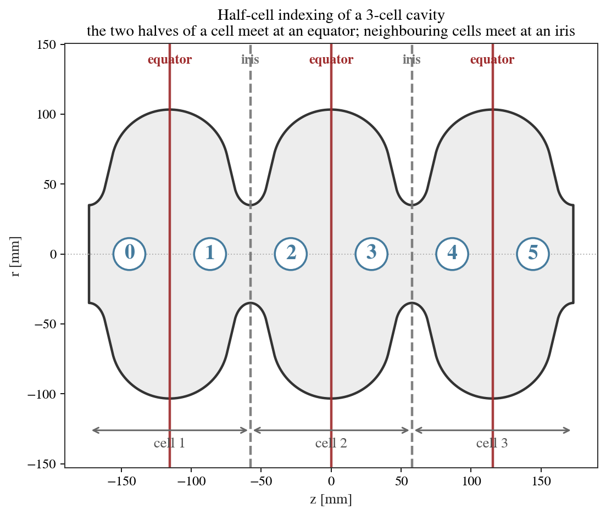
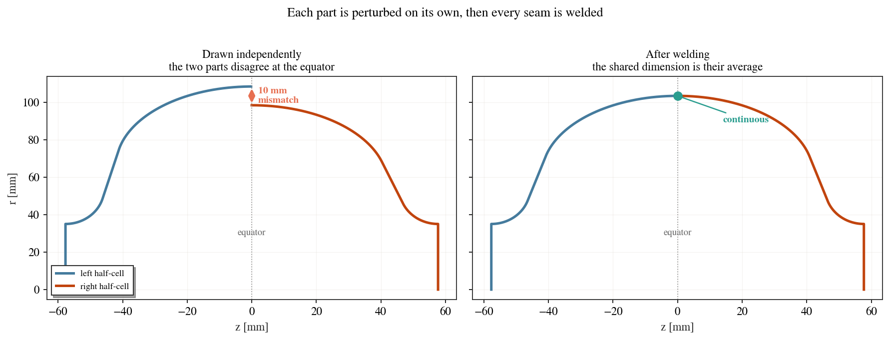
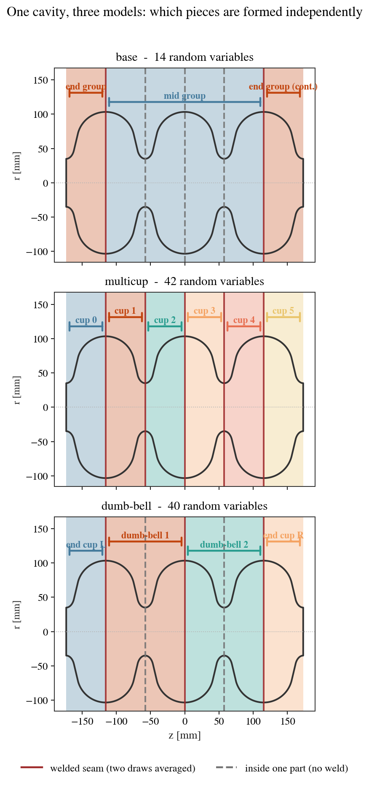
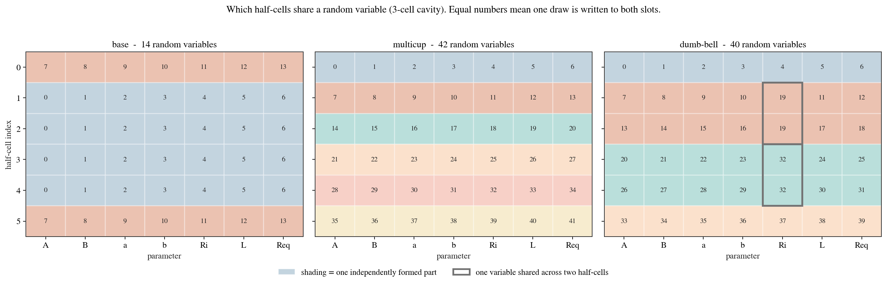

Uncertainty Quantification
==========================

The uncertainty quantification (UQ) module propagates fabrication tolerances and alignment errors through the solver chain to compute the statistical distribution (mean and standard deviation) of the RF figures of merit. This enables designers to assess how manufacturing variability impacts cavity performance before committing to a fabrication run.

Interface
*********
UQ capabilities are integrated directly into existing analyses by nesting a ``uq_config`` sub-dictionary inside the solver configuration (e.g. inside ``eigenmode_config`` or ``wakefield_config``):

.. code-block:: python

    uq_config = {
        'variables': ['L', 'Req'],
        'delta': [0.05, 0.05],
        'method': ['Quadrature', 'Stroud3'],
        'distribution': 'gaussian',
        'cell_type': 'mid-cell',
        'cell_complexity': 'simplecell'
    }

    eigenmode_config = {
        'processes': 3,
        'rerun': True,
        'boundary_conditions': 'mm',
        'uq_config': uq_config
    }

    cavs.run_eigenmode(eigenmode_config)

This runs the eigenmode solver at a set of perturbed geometry points (quadrature nodes) and aggregates the results into statistical moments.

Configuration Settings
**********************

``variables``
   *(list of str)* The geometric variables to perturb, e.g. ``['L', 'Req']``. Each variable corresponds to a dimension of the elliptical cell parameterisation (see :doc:`quickstart` for the parameter naming convention).

``delta``
   *(list of float)* The perturbation magnitude for each variable (in mm). Interpreted as the standard deviation when ``distribution`` is ``'gaussian'``, or the half-width when ``distribution`` is ``'uniform'``.

``method``
   *(list)* The UQ evaluation method. The recommended default is ``['Quadrature', 'Stroud3']``, which uses Stroud's third-order symmetric cubature rule. This minimises the number of simulation evaluations while capturing second-order statistical moments.

``distribution``
   *(str, default:* ``'gaussian'`` *)* Probability distribution model: ``'gaussian'`` (normal) or ``'uniform'``.

``cell_type``
   *(str, default:* ``'mid-cell'`` *)* The type of cell to which the perturbation is applied.

``cell_complexity``
   *(str, default:* ``'simplecell'`` *)* Determines whether perturbations are applied to a single cell (``'simplecell'``) or the full multi-cell structure (``'multicell'``, where every half-cell becomes an independent random variable subject to the equator/iris continuity constraints). Both are available for eigenmode and wakefield UQ.

``processes``
   *(int, default: 1)* Number of parallel processes for evaluating the perturbed quadrature nodes.

Visualising Results
*******************
Once the UQ simulation finishes, the standard deviations are populated in the results database. You can compare the fundamental-mode quantities with error bars across different cavities:

.. code-block:: python

    cavs.eigenmode.plot_fm_bar(uq=True)

.. important::

   Running UQ perturbations near degenerate geometries can lead to errors. For example, applying perturbations to a cavity with geometric dimensions close to physical constraints (like some reentrant cavity designs) may produce invalid or self-intersecting shapes. Use ``cav.inspect()`` to verify that the perturbation range defined by ``delta`` does not push the geometry beyond its valid limits.

See the worked examples in :doc:`Advanced: UQ everywhere <examples/advanced/index>`.

Choosing a perturbation model
*****************************

A tolerance can be posed in more than one way, and the choice changes the answer. The
models below are different descriptions of the manufacturing route, not coarse and fine
versions of one description. None of them is established here as the correct description
of a real cavity: that is an empirical question about fabrication data.

How a cavity is divided
=======================

cavsim2d indexes an elliptical cavity as ``2n`` **half-cells** for *n* cells, ordered left
to right. Cell *k* is the pair ``(half_cells[2k], half_cells[2k+1])``, so the two halves of
a cell meet at its **equator**, and neighbouring cells meet at an **iris**.

         each cell and irises marked between cells.
   :align: center

   The six half-cells of a 3-cell cavity. Equators lie inside a cell; irises lie between
   cells.

One consequence is worth stating, because it surprises people: the first cell is
``end_l`` paired with a *mid* half, so ``Req_el`` and ``Req_m`` name the **same physical
equator**. They are not independent dimensions.

What welding does
=================

Each part of a real cavity is formed on its own, so its dimensions carry their own error.
Where two parts meet, the finished cavity has one dimension, not two. cavsim2d reproduces
that: it perturbs every part independently and then **welds** each seam by averaging the
two values that meet there.

         equator, beside the same pair after averaging, which closes the step.
   :align: center

   Left: two half-cells whose equator radius was drawn independently, so the profile does
   not close. Right: after welding, both carry the average and the profile is continuous.

Welding is not only a repair for a discontinuity. It reduces spread: averaging two
independent draws of standard deviation :math:`\sigma` gives one value of standard
deviation :math:`\sigma/\sqrt{2}`. A model that welds a joint therefore predicts a
narrower distribution than one that does not.

The three models
================

         independently formed part they belong to, and each seam marked as a weld or as
         internal to one part.
   :align: center
   :width: 85%

   The same cavity under each model. Shading groups the half-cells that come from one
   independently formed part. A solid line is a welded seam, where two draws are
   averaged; a dashed line lies inside a single part, so nothing is averaged there.

The three models differ in how finely the cavity is divided, and therefore in how many
seams are welds:

* **base** has two parts, so only the two mid-to-end equators are welds.
* **multicup** has one part per half-cell, so every equator and every iris is a weld.
* **dumb-bell** has one part per dumb-bell, so the equators are welds but the irises are
  internal.

         variable drives each slot, for the base, multicup and dumb-bell models.
   :align: center

   Which half-cells share a random variable. Equal numbers mean one draw is written to
   both slots.

``'base'``
   One tolerance per cell *type*. Every mid half-cell shares a draw, and so do the two end
   half-cells, which gives 14 random variables **whatever the cell count**. When the two
   end cells are different designs they get their own variables, giving 21. This is what a
   drawing tolerance usually states.

``'multicup'``
   Every half-cell formed independently: ``14n`` variables for *n* cells. Both the irises
   and the equators are welds, and each averages two independent draws.

``'dumbbell'``
   Dumb-bells formed as units, matching the usual assembly sequence. Each half keeps its
   own ``A``, ``B``, ``a``, ``b``, ``L`` and ``Req``, but the two halves of a dumb-bell
   share **one** iris radius, because that joint is machined rather than welded. That
   gives ``13n + 1`` variables, and leaves only the equators as welds.

Build a model with :func:`~cavsim2d.analysis.uq.perturbation_slots`, which reads the
geometry to decide whether the end cells share a draw::

    from cavsim2d import EllipticalCavity, perturbation_slots

    cav = EllipticalCavity(3, MID, END_L, END_R, beampipe='both')
    for kind in ('base', 'multicup', 'dumbbell'):
        print(kind, len(perturbation_slots(cav, kind)))

Pass ``split_ends=True`` to give the two end cells their own variables even when they are
the same design. Use it when the two end cups are formed separately, so their errors are
independent rather than sharing one tooling error.

Two paths through the solver
****************************

``uq_config`` reaches the geometry by one of two paths, and they differ in what they can
represent.

Simplecell path
===============

The default. ``cell_complexity`` is ``'simplecell'``, and the perturbation is applied to
the model's own parameters (``A_m``, ``Req_el``, and so on). It is the cheaper path and it
is enough when one tolerance per cell type is what you mean.

.. caution::

   On this path the geometry builder forces ``Req = Req_m`` across the whole cavity, so
   the ``Req_el`` and ``Req_er`` components of a perturbation are discarded. If you
   include ``Req`` in ``variables`` with ``cell='all'``, then two of the random dimensions
   do nothing, and a cubature rule is evaluated on fewer active dimensions than it was
   built for. Use the multicell path when you want independent equator draws.

Multicell path
==============

Set ``cell_complexity='multicell'`` and ``independent_half_cells=True``. Every half-cell
carries its own parameters, the draws are independent, and each seam is welded afterwards
as shown above. This path is the one to use whenever parts are formed separately.

Which path supports which model:

.. list-table::
   :header-rows: 1
   :widths: 30 35 35

   * - Model
     - Simplecell path
     - Multicell path
   * - ``base``
     - yes
     - yes
   * - ``multicup``
     - no
     - yes
   * - ``dumbbell``
     - no
     - yes

The simplecell path perturbs the model's own parameters, and those name a cell *type*
rather than an individual part. It can therefore express ``base`` and nothing finer. Both
``multicup`` and ``dumb-bell`` need per-half-cell parameters, so they need the multicell
path.

.. code-block:: python

    uq_config = {
        'variables': ['A', 'B', 'a', 'b', 'Ri', 'L', 'Req'],
        'delta': [0.3] * 7,                     # absolute tolerance, mm
        'method': ['Normal', 500],
        'cell_complexity': 'multicell',
        'independent_half_cells': True,
        'objectives': ['monopole:freq [MHz]', 'monopole:R/Q [Ohm]'],
        'processes': 6,
    }

    cavs.run_eigenmode({'processes': 1, 'boundary_conditions': 'mm',
                        'uq_config': uq_config})

Comparing models and rules
**************************

:func:`~cavsim2d.analysis.uq.plot_uq_comparison` draws several labelled UQ result sets
side by side, one panel per figure of merit. Give it ``uq.json`` paths, the directories
holding them, or loaded dictionaries::

    from cavsim2d import plot_uq_comparison

    plot_uq_comparison({'base': 'runs/base/uq', 'multicup': 'runs/multicup/uq'},
                       nominal=cav.eigenmode_qois)

The default view plots the mean with a :math:`\pm 1\sigma` error bar. The bar is the
**spread of the ensemble**, not the uncertainty of the estimate, which is smaller by
:math:`\sqrt{N}`.

To compare spreads rather than centres, pass ``kind='sd'``, which puts the standard
deviation on the axis, optionally as a ratio against a named result set::

    plot_uq_comparison({'MC': 'runs/mc/uq', 'Stroud3': 'runs/s3/uq'},
                       kind='sd', reference='MC')

A difference of 20% in standard deviation is hard to see as a difference in error-bar
length, so use ``kind='sd'`` when the question is whether two methods agree on the
spread. :func:`~cavsim2d.analysis.uq.uq_comparison_table` returns the same numbers as a
``DataFrame``.
